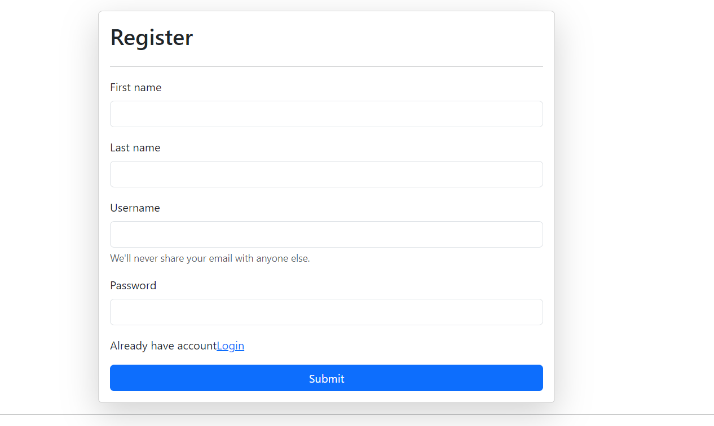
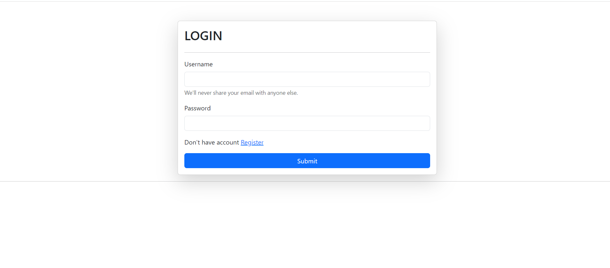
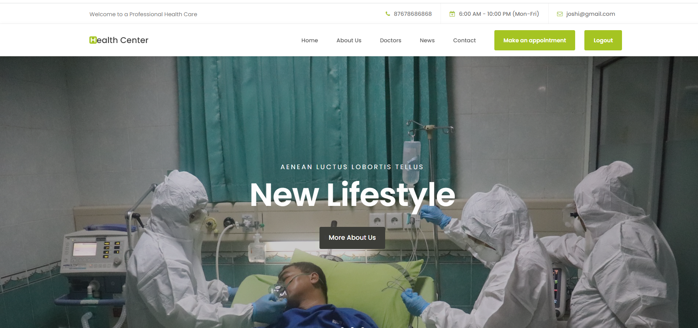
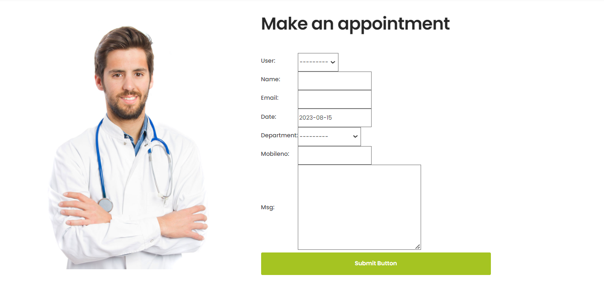
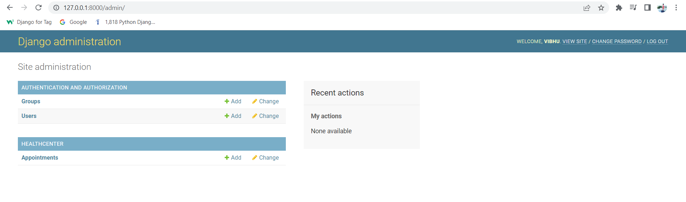

# HMSProject
Hospital Management project based on Python Django-FrameWork
# These are the step’s to run a Online Hospital  Management System Project in Django:-
# 1. pip install virtualenv
First, You need to install the virtualenv, Open a command prompt by going to the project folder directory and typing CMD. After opening the CMD type ” pip install virtualenv “.
# 2. virtualenv venv
Then, after installing virtualenv just type “virtualenv venv” and enter.
# 3.activate
Next, you need to type “activate” then press enter.
(venv\scripts\activate).
# 4.Install Django
Next, type the command “pip install django”.
# 5.Create App inside the Project
python manage.py startapp appname
# 6.Register your app name inside the project settings.py
# 7.Ural Mapping inside the project urls.py
# 8.Create new file inside the app urls.py
# 9.Create model Hospital Management inside the app models.py
# 10.Apply migrations command 
# python manage.py makemigrations
Next, after installing the requirements type this command ” python manage.py makemigrations ” to create a tables in the database.
# python manage.py migrate
# 11.python manage.py createsuperuser
After migration of database you need to create super user to login in the admin account, just you need is to type the command ” python manage.py createsuperuser “.
# 12.python manage.py runserver
Lastly, after creating super user just type the command ” python manage.py runserver “. It should only be used for testing and launching your project; it should not be utilized for live website deployment.
# 13.http://127.0.0.1:8000/
Finally, To access your project dashboard, type or copy this “http://127.0.0.1:8000/” into your browser.

# APPOINTMENT !!!!!!
First we need to register 

Second we are login in the dashboard 

then after that we will be able for appointment

# Footer !!!!

# Admin panel All the Appointment are Stored in Database.

# CONCLUSION:-
In conclusion, the Hospital management system in  organizations will be this web method will empower them because it will provide them the greatest advantage and advantage over their competitors who are not subscribers to this initiative. Many more plat forms exist, but they all have flaws, as evidenced by the literature covered in this chapter. As a result, it is critical to investigate various resources that are both widely available and offer a better mix and improvement to increase the Hospital Management firm throughout the world.
